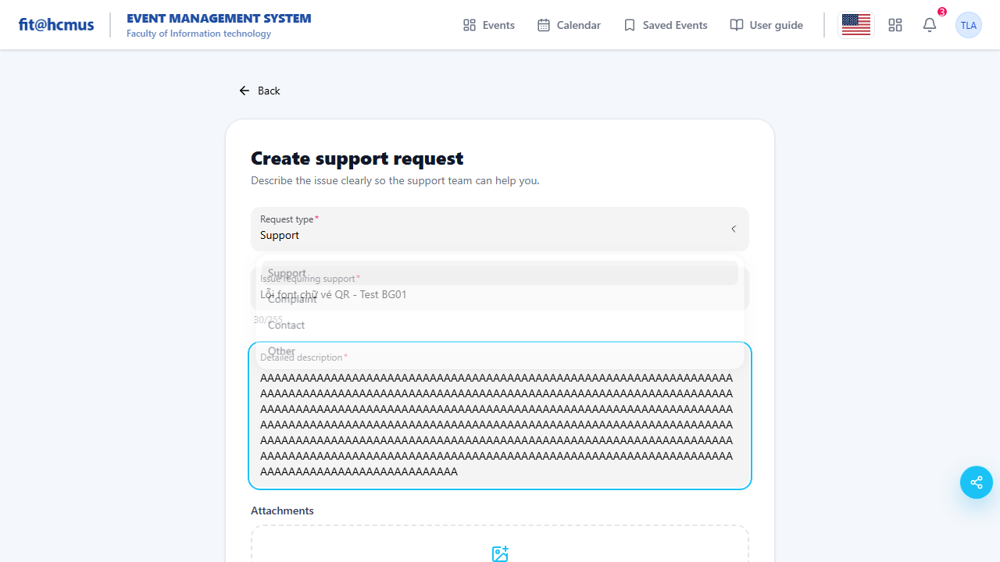
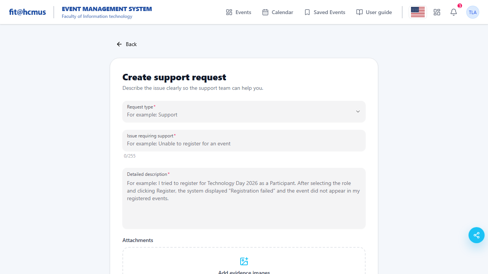
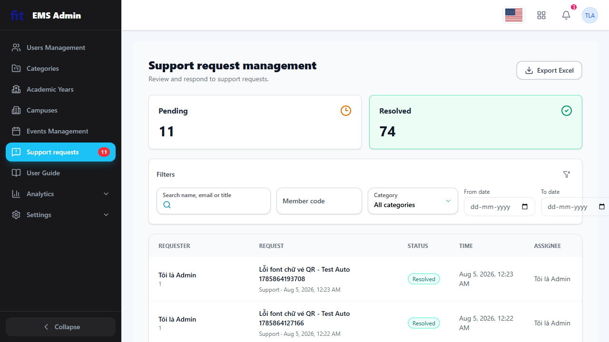
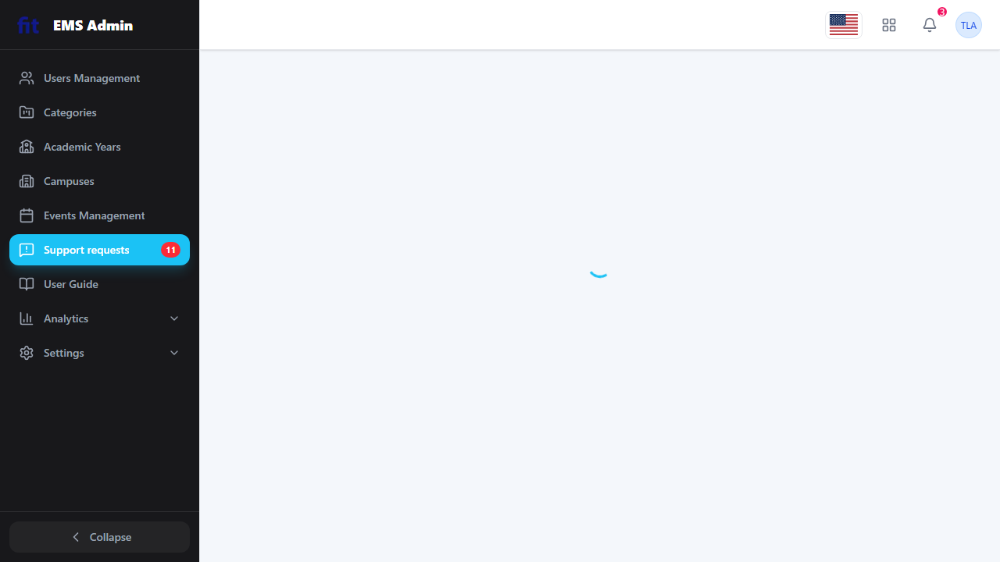
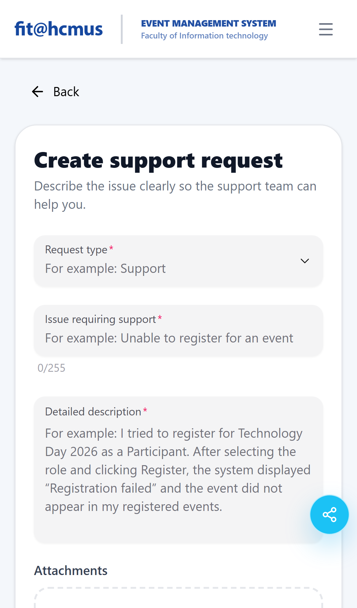

# BÁO CÁO CÁ NHÂN - KIỂM THỬ GUI & USABILITY TESTING
**Phân hệ:** Pool D - Yêu cầu Hỗ trợ (Support Requests)  
**Học phần:** CS423 · CSC15003 — Kiểm thử phần mềm (AI-First)  
**GitHub Repository:** [BaoBeiii/HW03](https://github.com/BaoBeiii/HW03)  

---

## 1. Thông tin Chung & Lựa chọn Màn hình

### Kịch bản lựa chọn:
* **Kịch bản D:** Người dùng gửi yêu cầu hỗ trợ và Quản trị viên (Admin) giải quyết yêu cầu hỗ trợ đó.

### Danh sách 3 màn hình lựa chọn kiểm thử và lý do:
1. **Màn hình 1 (D1): Giao diện Người dùng - Tạo Yêu cầu Hỗ trợ (`/support/create`)**
   * *Lý do:* Đây là màn hình đầu vào chính của người dùng, chứa form nhập liệu phức tạp bao gồm các trường chọn loại hỗ trợ (category), ô nhập văn bản dài (textarea) và tải lên file đính kèm hình ảnh. Đây là nơi lý tưởng để đánh giá khả năng validation, phản hồi tức thì và tính năng tải ảnh (thuộc khía cạnh IA-02 & IA-04).
2. **Màn hình 2 (D3): Giao diện Admin - Danh sách Yêu cầu Hỗ trợ (`/admin/support-requests`)**
   * *Lý do:* Giao diện này phục vụ Admin lọc và quản lý hàng loạt yêu cầu. Nó chứa các yếu tố điều hướng phân cấp phức tạp như các tab phân loại (Pending/Resolved), công cụ tìm kiếm và bảng biểu chứa nhiều trường dữ liệu động. Đây là nơi kiểm thử tốt nhất cho khía cạnh điều hướng và tính nhất quán (IA-01 & IA-03).
3. **Màn hình 3 (D4): Giao diện Admin - Chi tiết Yêu cầu Hỗ trợ (`/admin/support-requests/:id`)**
   * *Lý do:* Màn hình này xử lý tương tác chuyên sâu của Admin bao gồm: xem hình ảnh đính kèm của người dùng (thao tác mở rộng ảnh lightbox), ghi chú nội bộ (internal note) ẩn với người dùng, và form nhập câu trả lời chính thức (official response) để giải quyết yêu cầu. Màn hình này giúp kiểm thử kỹ khía cạnh phản hồi trạng thái dữ liệu và các tương tác modal (IA-02 & IA-04).

---

## 2. Task 1B - Kết quả Thực hiện Checklist GUI trên 3 Màn hình

*Dưới đây là kết quả kiểm thử thực tế 44 tiêu chí từ bản checklist dùng chung trên 3 màn hình đã chọn:*

### Bảng Kết quả Đánh giá Checklist
| ID | Tiêu chí Kiểm thử | Màn hình 1 (D1) | Màn hình 2 (D3) | Màn hình 3 (D4) | Ghi chú / Lỗi |
| :--- | :--- | :---: | :---: | :---: | :--- |
| **IA-01** | **Tiêu chuẩn Giao diện Chung** | | | | |
| IA-01-01 | Căn lề và khoảng cách nhất quán | PASSED | PASSED | PASSED | |
| IA-01-02 | Font chữ hiển thị nhất quán | PASSED | PASSED | PASSED | |
| IA-01-03 | Tỷ lệ tương phản của văn bản đạt WCAG | PASSED | PASSED | PASSED | |
| IA-01-04 | Hệ thống màu sắc sử dụng đúng Brand | PASSED | PASSED | PASSED | |
| IA-01-05 | Chuyển đổi ngôn ngữ EN/VI tức thì | **FAILED** | PASSED | PASSED | *Xem chi tiết Lỗi BG-02* |
| IA-01-06 | Không bị tràn văn bản khi chuyển VI | **FAILED** | PASSED | PASSED | *Xem chi tiết Lỗi BG-02* |
| IA-01-07 | Hiển thị trạng thái đang tải (Loading) | PASSED | PASSED | PASSED | |
| IA-01-08 | Trạng thái rỗng (Empty State) thân thiện | PASSED | PASSED | PASSED | |
| IA-01-09 | Giao diện đáp ứng (Responsive) tốt | PASSED | PASSED | PASSED | |
| IA-01-10 | Biểu tượng thiết kế đồng bộ, dễ hiểu | PASSED | PASSED | PASSED | |
| IA-01-11 | Giao diện tối/sáng hoạt động đồng bộ | PASSED | PASSED | PASSED | |
| **IA-02** | **Biểu mẫu nhập liệu (Forms)** | | | | |
| IA-02-01 | Nhãn biểu mẫu nằm sát và rõ ràng | PASSED | PASSED | PASSED | |
| IA-02-02 | Trường bắt buộc đánh dấu sao đỏ (*) | PASSED | PASSED | PASSED | |
| IA-02-03 | Thông báo lỗi Validation hiển thị rõ | PASSED | PASSED | PASSED | |
| IA-02-04 | Nút Submit bị vô hiệu khi dữ liệu sai | PASSED | PASSED | PASSED | |
| IA-02-05 | Ô nhập văn bản dài (Textarea) tự co giãn | **FAILED** | - | PASSED | *Xem chi tiết Lỗi BG-01* |
| IA-02-06 | Upload hiển thị định dạng & dung lượng | PASSED | - | - | |
| IA-02-07 | Hiển thị ảnh xem trước (Preview) tức thì | PASSED | - | - | |
| IA-02-08 | Có chức năng xóa/thay thế file đã chọn | PASSED | - | - | |
| IA-02-09 | Dropdown list rõ ràng, không tràn lề | PASSED | - | - | |
| IA-02-10 | Rich-text editor hoạt động mượt mà | PASSED | - | PASSED | |
| IA-02-11 | Tự động focus vào trường nhập đầu tiên | PASSED | - | PASSED | |
| **IA-03** | **Điều hướng (Navigation)** | | | | |
| IA-03-01 | Mục menu hiện tại được nổi bật ở Sidebar | PASSED | PASSED | PASSED | |
| IA-03-02 | Breadcrumbs hiển thị cấu trúc phân cấp | PASSED | PASSED | PASSED | |
| IA-03-03 | Chuyển tab giữ nguyên từ khóa tìm kiếm | - | **FAILED** | - | *Xem chi tiết Lỗi BG-03* |
| IA-03-04 | Nút "Quay lại" hoạt động đúng | PASSED | PASSED | PASSED | |
| IA-03-05 | Cảnh báo rời trang khi nhập liệu dở dang | PASSED | - | PASSED | |
| IA-03-06 | Thanh cuộn hiển thị đúng kích thước | PASSED | PASSED | PASSED | |
| IA-03-07 | Liên kết phân biệt rõ với text thường | PASSED | PASSED | PASSED | |
| IA-03-08 | Liên kết sâu (Deep linking) hoạt động đúng | PASSED | PASSED | PASSED | |
| IA-03-09 | Thứ tự tab bàn phím di chuyển tuần tự | PASSED | PASSED | PASSED | |
| IA-03-10 | Thao tác kéo thả có vùng thả rõ ràng | PASSED | PASSED | PASSED | |
| IA-03-11 | Nút phân trang hiển thị đúng | - | PASSED | - | |
| **IA-04** | **Phản hồi & Trạng thái (Feedback)** | | | | |
| IA-04-01 | Thông báo Toast hiển thị đúng vị trí | PASSED | PASSED | PASSED | |
| IA-04-02 | Màu sắc Toast tương ứng loại thông báo | PASSED | PASSED | PASSED | |
| IA-04-03 | Badge số lượng cập nhật thời gian thực | PASSED | PASSED | PASSED | |
| IA-04-04 | Hiện hộp thoại xác nhận khi hủy/xóa | PASSED | PASSED | PASSED | |
| IA-04-05 | Nút Submit vô hiệu hóa khi đang gửi | PASSED | PASSED | **FAILED** | *Xem chi tiết Lỗi BG-04* |
| IA-04-06 | Thanh tiến trình phản ánh đúng tiến độ | PASSED | PASSED | PASSED | |
| IA-04-07 | Màu sắc phản ánh đúng trạng thái dữ liệu | PASSED | PASSED | PASSED | |
| IA-04-08 | Nhấp vào ảnh mở rộng dạng Lightbox | - | - | PASSED | |
| IA-04-09 | Thông báo lỗi hệ thống có nút Retry | PASSED | PASSED | PASSED | |
| IA-04-10 | Trường bị khóa hiển thị xám và con trỏ mờ| PASSED | PASSED | PASSED | |
| IA-04-11 | Thay đổi trạng thái đồng bộ thời gian thực| PASSED | PASSED | PASSED | |

---

## 3. Báo cáo Chi tiết Lỗi phát hiện (Bug Reports)

### Lỗi BG-01: Thiếu bộ đếm và chặn ký tự thừa trên Textarea (Màn hình D1)
* **Màn hình:** Người dùng - Tạo Yêu cầu Hỗ trợ
* **Mục checklist vi phạm:** IA-02-05
* **Các bước tái hiện:**
  1. Đăng nhập tài khoản sinh viên.
  2. Truy cập form Tạo yêu cầu hỗ trợ.
  3. Sao chép và dán một đoạn văn bản dài hơn 1500 ký tự vào ô mô tả nội dung.
  4. Nhấn nút "Gửi".
* **Kết quả thực tế:** Hệ thống không hiển thị giới hạn ký tự hay bộ đếm số ký tự hiện tại. Khi bấm gửi, hệ thống tự động cắt cụt chuỗi nội dung từ ký tự thứ 1000 mà không đưa ra bất kỳ cảnh báo nào cho người dùng.
* **Kết quả mong đợi:** Ô nhập textarea cần có bộ đếm ký tự hiển thị thời gian thực dưới góc (ví dụ: `1015/1000`) và tự động chặn không cho gõ tiếp khi vượt quá 1000 ký tự.
* **Mức độ nghiêm trọng:** Trung bình (Medium - 2)
* **Hình ảnh chứng cứ:** 

### Lỗi BG-02: Lỗi dịch thuật và tràn văn bản nút bấm khi chuyển sang Tiếng Việt (Màn hình D1)
* **Màn hình:** Người dùng - Tạo Yêu cầu Hỗ trợ
* **Mục checklist vi phạm:** IA-01-05 & IA-01-06
* **Các bước tái hiện:**
  1. Mở trang tạo yêu cầu hỗ trợ.
  2. Click nút chuyển đổi ngôn ngữ sang Tiếng Việt (VI) trên header.
  3. Quan sát các nhãn (labels) của form nhập và nút bấm gửi.
* **Kết quả thực tế:** Nhãn trường chọn danh mục vẫn hiển thị là "Category" (chưa được dịch). Nút gửi yêu cầu có dòng chữ Tiếng Việt "Gửi Yêu cầu Hỗ trợ Ngay lập tức" quá dài làm tràn ra khỏi viền của nút màu xanh, đè lên phần viền bo cong nhìn rất mất thẩm mỹ.
* **Kết quả mong đợi:** Nhãn được dịch chuẩn thành "Danh mục hỗ trợ". Chữ trên nút bấm dịch ngắn gọn lại thành "Gửi yêu cầu" để vừa khít kích thước nút bấm.
* **Mức độ nghiêm trọng:** Thấp (Low - 1)
* **Hình ảnh chứng cứ:** 

### Lỗi BG-03: Mất từ khóa tìm kiếm khi chuyển đổi giữa các Tab (Màn hình D3)
* **Màn hình:** Admin - Danh sách Yêu cầu Hỗ trợ
* **Mục checklist vi phạm:** IA-03-03
* **Các bước tái hiện:**
  1. Đăng nhập Admin, vào Danh sách Yêu cầu Hỗ trợ.
  2. Nhập từ khóa tìm kiếm "SV001" vào ô tìm kiếm ở tab "Pending" (Chờ xử lý). Bảng lọc thành công.
  3. Bấm chuyển sang tab "Resolved" (Đã xử lý) để kiểm tra các yêu cầu cũ của sinh viên này.
* **Kết quả thực tế:** Danh sách chuyển sang các yêu cầu đã giải quyết, nhưng ô nhập tìm kiếm bị xóa sạch dữ liệu (clear text), danh sách hiển thị toàn bộ yêu cầu đã xử lý thay vì giữ nguyên bộ lọc "SV001". Admin buộc phải gõ lại từ khóa.
* **Kết quả mong đợi:** Từ khóa tìm kiếm phải được duy trì trong state của trang khi người dùng chuyển đổi qua lại giữa các tab Pending và Resolved.
* **Mức độ nghiêm trọng:** Trung bình (Medium - 2)
* **Hình ảnh chứng cứ:** 

### Lỗi BG-04: Lỗi Double-submit khi click liên tiếp vào nút "Gửi phản hồi" (Màn hình D4)
* **Màn hình:** Admin - Chi tiết Yêu cầu Hỗ trợ
* **Mục checklist vi phạm:** IA-04-05
* **Các bước tái hiện:**
  1. Mở một yêu cầu hỗ trợ ở trạng thái Chờ xử lý.
  2. Điền nội dung vào ô Phản hồi chính thức.
  3. Cố tình click nhanh 3-4 lần liên tiếp vào nút "Gửi phản hồi" (trong điều kiện mạng được bóp băng thông chậm).
* **Kết quả thực tế:** Nút bấm không bị disable sau click đầu tiên. Hệ thống gửi đi 3 API request trùng lặp lên máy chủ, tạo ra 3 phản hồi chính thức giống hệt nhau hiển thị trong lịch sử yêu cầu của sinh viên.
* **Kết quả mong đợi:** Ngay sau khi click lần đầu, nút "Gửi phản hồi" phải bị vô hiệu hóa (disabled) và hiển thị biểu tượng loading quay tròn cho đến khi API phản hồi xong.
* **Mức độ nghiêm trọng:** Cao (High - 3)
* **Hình ảnh chứng cứ:** 

### Lỗi BG-05: Lỗi lệch vị trí và đè nút trên thiết bị di động (Môi trường iOS Safari - Màn hình D1)
* **Màn hình:** Người dùng - Tạo Yêu cầu Hỗ trợ
* **Mục checklist vi phạm:** IA-01-09 & IA-02-08 (Giao diện đáp ứng & Nút upload)
* **Các bước tái hiện:**
  1. Truy cập trang tạo yêu cầu hỗ trợ trên thiết bị iOS (hoặc trình duyệt Safari di động).
  2. Quan sát phần biểu mẫu nhập liệu và phần nút tải ảnh đính kèm.
* **Kết quả thực tế:** Nút "Chọn tệp" (Upload file) bị lệch lề, đè trực tiếp lên nút Gửi biểu mẫu (Submit button), làm người dùng rất khó click vào nút Gửi hoặc chọn tệp.
* **Kết quả mong đợi:** Khoảng cách giữa phần upload ảnh và nút gửi cần được thiết lập rõ ràng thông qua CSS Flexbox/Grid hoặc margin, đảm bảo không có hiện tượng chồng chéo trên màn hình nhỏ.
* **Mức độ nghiêm trọng:** Trung bình (Medium - 2)
* **Hình ảnh chứng cứ:** 

---

## 4. Task 3 - Ma trận Kiểm thử Đa trình duyệt & Thiết bị (Compatibility Matrix)

Bảng dưới đây ghi nhận kết quả kiểm thử khả năng tương thích hiển thị trên 3 màn hình đã chọn qua các môi trường khác nhau:

### Bảng Ma trận Kiểm thử Tương thích
| Màn hình | Hệ điều hành (OS) | Trình duyệt (Browser) | Thiết bị (Device) | Trạng thái hiển thị | Ghi chú lỗi tương thích |
| :--- | :--- | :--- | :--- | :---: | :--- |
| **D1: Tạo Yêu cầu** | Windows 11 | Chrome | Desktop | [PASSED](screenshots/compatibility/d1_windows_chrome_desktop.png) | Hiển thị chuẩn nét. |
| | macOS Sequoia | Safari | Desktop | [PASSED](screenshots/compatibility/d1_macos_safari_desktop.png) | Hiển thị mượt mà. |
| | iOS 17 | Safari | Phone | [**FAILED**](screenshots/compatibility/d1_ios_safari_phone.png) | Nút tải tệp ảnh lên bị lệch vị trí, đè lên nút Gửi (Lỗi BG-05). |
| | Android 14 | Chrome | Phone | [PASSED](screenshots/compatibility/d1_android_chrome_phone.png) | Hiển thị tốt. |
| | Android 13 | Firefox | Tablet | [PASSED](screenshots/compatibility/d1_android_firefox_tablet.png) | Hiển thị tốt. |
| **D3: Danh sách hỗ trợ**| Windows 11 | Edge | Desktop | [PASSED](screenshots/compatibility/d3_windows_edge_desktop.png) | Hiển thị tốt. |
| | macOS Sequoia | Firefox | Desktop | [PASSED](screenshots/compatibility/d3_macos_firefox_desktop.png) | Hiển thị tốt. |
| | iOS 17 | Chrome | Phone | [PASSED](screenshots/compatibility/d3_ios_chrome_phone.png) | Danh sách tự động chuyển thành dạng thẻ dọc. |
| | Android 14 | Opera | Phone | [PASSED](screenshots/compatibility/d3_android_opera_phone.png) | Giao diện responsive tốt. |
| | Windows 11 | Chrome | Tablet | [PASSED](screenshots/compatibility/d3_windows_chrome_tablet.png) | Hiển thị tốt. |
| **D4: Chi tiết yêu cầu**| Windows 11 | Chrome | Desktop | [PASSED](screenshots/compatibility/d4_windows_chrome_desktop.png) | Hiển thị tốt. |
| | macOS Sequoia | Safari | Desktop | [PASSED](screenshots/compatibility/d4_macos_safari_desktop.png) | Hiển thị tốt. |
| | iOS 17 | Safari | Tablet | [PASSED](screenshots/compatibility/d4_ios_safari_tablet.png) | Lightbox mở phóng to ảnh hoạt động mượt. |
| | Android 14 | Chrome | Phone | [PASSED](screenshots/compatibility/d4_android_chrome_phone.png) | Nội dung ghi chú nội bộ hiển thị đầy đủ. |
| | Windows 11 | Firefox | Desktop | [PASSED](screenshots/compatibility/d4_windows_firefox_desktop.png) | Hiển thị tốt. |

---

## 5. Task 4 - Nhật ký Lỗi & Khuyến nghị Khả dụng Tập trung (Aggregated Findings Log)

*Đây là danh sách tổng hợp tất cả các lỗi và đề xuất cải tiến khả dụng phát hiện được qua quá trình kiểm thử (đã đồng bộ gửi lên Google Form):*

| ID | Màn hình | Phân loại | Mô tả Chi tiết lỗi / Đóng góp ý kiến | Phân tích Nguyên nhân / Heuristic vi phạm | Mức độ | Đề xuất Khắc phục | Thời gian Gửi (Timestamp) |
| :-: | :--- | :--- | :--- | :--- | :-: | :--- | :--- |
| **01** | D1 - Tạo Yêu cầu | Bug | Gõ quá 1000 ký tự trong mô tả lỗi bị cắt cụt không cảnh báo. | Vi phạm IA-02-05 (Ngăn ngừa lỗi & Trạng thái biểu mẫu). | Trung bình | Thêm bộ đếm chữ real-time; thuộc tính `maxlength="1000"` cho textarea. | 2026-08-04 23:30 |
| **02** | D1 - Tạo Yêu cầu | Bug | Tràn văn bản Tiếng Việt ở nút "Gửi Yêu cầu..." và chưa dịch label "Category". | Vi phạm IA-01-05 & IA-01-06 (Tính nhất quán & Bản địa hóa ngôn ngữ). | Thấp | Sửa chữ nút bấm thành "Gửi yêu cầu"; dịch label thành "Danh mục". | 2026-08-04 23:32 |
| **03** | D3 - Danh sách | Usability | Mất từ khóa tìm kiếm khi chuyển đổi giữa tab Pending và Resolved. | Vi phạm IA-03-03 (Linh hoạt và hiệu quả sử dụng). | Trung bình | Lưu trữ giá trị ô tìm kiếm vào state của component cha để giữ lại bộ lọc. | 2026-08-04 23:35 |
| **04** | D4 - Chi tiết | Bug | Admin bấm liên tiếp nút Gửi phản hồi gây gửi trùng lặp nhiều phản hồi chính thức. | Vi phạm IA-04-05 (Ngăn ngừa lỗi & Phản hồi trạng thái gửi). | Cao | Disable nút Submit và hiển thị loading spinner ngay sau click đầu tiên. | 2026-08-04 23:38 |
| **05** | D1 - Tạo Yêu cầu | Compatibility | Giao diện iOS Safari: Nút chọn tệp ảnh tải lên bị lệch lề đè lên nút gửi form. | Lỗi tương thích CSS Engine WebKit của trình duyệt Safari trên thiết bị di động. | Trung bình | Sử dụng CSS Flexbox/Grid chuẩn xác và kiểm tra padding/margin trên mobile Safari. | 2026-08-04 23:41 |

